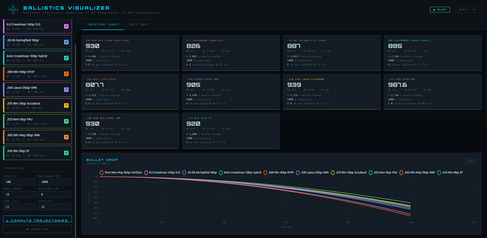

# Ballistics Visualizer

[](https://github.com/dirkharrington/ballistics/actions/workflows/ci.yml)

A physics-accurate external ballistics calculator and trajectory visualizer. Compare up to ten rifle cartridges side-by-side across drop, velocity, retained energy, and wind drift — out to 2,000 metres.



---

## Table of Contents

- [Features](#features)
- [Physics Model](#physics-model)
- [Tech Stack](#tech-stack)
- [Getting Started](#getting-started)
  - [Prerequisites](#prerequisites)
  - [Run with Maven](#run-with-maven)
  - [Run with Docker](#run-with-docker)
  - [Run with Monitoring Stack](#run-with-monitoring-stack)
- [API Reference](#api-reference)
- [Bullet Catalog](#bullet-catalog)
- [Configuration](#configuration)
- [Architecture](#architecture)
- [Testing](#testing)
- [Project Structure](#project-structure)

---

## Features

| Feature | Detail |
|---|---|
| **Multi-round comparison** | Select any combination of the 10 built-in cartridges and plot them on the same axes |
| **Custom round** | Enter your own weight, muzzle velocity, G1 BC, and diameter |
| **Four charts** | Bullet drop (cm), velocity (m/s), energy (J), wind drift (cm) vs. range |
| **Data table** | Full tabular output — range, drop, velocity, energy, wind drift, time of flight |
| **CSV / PNG export** | Download the data table as CSV or any chart as a PNG |
| **Configurable conditions** | Zero range, max range, step interval, wind speed, altitude, temperature |
| **Offline fallback** | If the API is unreachable the browser runs the same RK4 integrator client-side; the status pill switches to ⚠ OFFLINE |
| **OpenAPI docs** | Interactive Swagger UI at `/swagger-ui.html` |
| **Prometheus metrics** | Compute latency histograms per bullet at `/actuator/prometheus` |

---

## Physics Model

The trajectory solver uses a **4th-order Runge-Kutta (RK4)** integrator at 0.5 ms timesteps. The same integrator runs in both the Java backend and the JavaScript offline fallback, so results are consistent regardless of connectivity.

### Drag

The G1 drag function is implemented as a piecewise-linear interpolation over the 41-point Ingalls/Siacci table, covering 0–4,000 fps.

```
Cd = interpolate_G1(|v|) × ρ/BC
```

where `ρ` is the air density ratio corrected for altitude and temperature (standard ISA atmosphere model).

### Atmosphere model

```
pressureRatio = (1 − 6.876×10⁻⁶ × altFt)^5.256
tempRatio     = (459.67 + T_std_at_alt) / (459.67 + T_actual)
ρ             = pressureRatio × tempRatio
```

### Zero-angle solver

A 64-iteration bisection converges the launch angle until the bullet crosses the line-of-sight at the zero range, accounting for sight height (default 38.1 mm / 1.5 in).

### Wind drift

Uses the Pejsa time-of-flight method. Lateral drift is proportional to the difference between actual TOF and vacuum TOF at the same range, eliminating the constant-velocity approximation.

```
drift = windSpeed_fps × (TOF_actual − rangeYd × 3 / (mv × cos θ)) × 12
```

---

## Tech Stack

### Backend

| Layer | Technology |
|---|---|
| Runtime | Java 21 source-compatibility; JDK 21+ required (tested on JDK 25), virtual threads (`spring.threads.virtual.enabled=true`) |
| Framework | Spring Boot 4 |
| Caching | Caffeine (500 entries, 5-minute TTL) |
| Rate limiting | Bucket4j (30 compare requests / minute) |
| Validation | Jakarta Bean Validation |
| API docs | springdoc-openapi (Swagger UI) |
| Metrics | Micrometer + Prometheus |
| Logging | Logback + logstash-logback-encoder (JSON) |
| Coverage | JaCoCo 0.8.13 (≥ 90 % instruction + branch) |

### Frontend

| Layer | Technology |
|---|---|
| Language | Vanilla JavaScript (ES6 modules) |
| Build tool | Vite 6 |
| Charts | Chart.js 4 (tree-shaken) |
| Fonts | Orbitron, Rajdhani, Share Tech Mono |
| Tests | Jest 29 + jsdom |

### Infrastructure

| Concern | Approach |
|---|---|
| Container | Multi-stage Docker build (Maven → layered JAR → jlink minimal JRE → Alpine) |
| Monitoring | Docker Compose stack: Prometheus v3 + Grafana 12 with pre-built dashboard |
| Compression | HTTP gzip for HTML, CSS, JS, JSON (≥ 1 KB) |
| Static caching | `Cache-Control: max-age=31536000, public` on content-hashed assets |
| CORS | Configurable origin allowlist via `app.cors.allowed-origins` |

---

## Getting Started

### Prerequisites

- **Java 21+**
- **Maven 3.9+**
- **Node.js 18+** (bundled automatically by `frontend-maven-plugin` on first build)
- Docker (optional)

### Run with Maven

```bash
git clone https://github.com/dirkharrington/ballistics.git
cd ballistics
mvn spring-boot:run
```

Open [http://localhost:8080](http://localhost:8080).

The first build downloads Node.js and npm packages automatically — subsequent builds use the cached `node/` directory.

### Run with Docker

```bash
docker build -t ballistics-visualizer .
docker run -p 8080:8080 ballistics-visualizer
```

The multi-stage build produces a minimal Alpine image (~90 MB) using a jlink-trimmed JRE containing only the modules the application actually uses.

To override the allowed CORS origins at runtime:

```bash
docker run -p 8080:8080 \
  -e APP_CORS_ALLOWED_ORIGINS=https://yourdomain.com \
  ballistics-visualizer
```

### Run with Monitoring Stack

Starts the app alongside Prometheus and Grafana using Docker Compose:

```bash
docker compose up --build
```

| Service | URL | Credentials |
|---|---|---|
| App | http://localhost:8080 | — |
| Prometheus | http://localhost:9090 | — |
| Grafana | http://localhost:3000 | admin / admin |

The pre-built **Ballistics Visualizer** dashboard loads automatically in Grafana and shows:

- Trajectory compute latency (p50 / p95 / p99) per bullet type
- HTTP request rate and error rate by endpoint
- Trajectory cache hit ratio
- JVM heap usage and GC pause time

Prometheus scrapes `/actuator/prometheus` every 15 seconds and retains 7 days of data.

---

## API Reference

Interactive docs are available at **`/swagger-ui.html`** once the server is running.

### `GET /api/bullets`

Returns the full bullet catalog.

**Response**
```json
[
  {
    "id": "308-win-168gr",
    "name": ".308 Win 168gr BTHP",
    "caliber": ".308 Winchester",
    "bulletWeightGrams": 10.89,
    "muzzleVelocityMps": 807.7,
    "ballisticCoefficient": 0.475,
    "bulletDiameterMm": 7.82,
    "muzzleEnergyJoules": 3552.0,
    "hexColor": "#F97316",
    "description": "..."
  }
]
```

---

### `POST /api/trajectory`

Compute a single-bullet trajectory.

**Request**
```json
{
  "bulletId": "308-win-168gr",
  "zeroRangeMeters": 100,
  "maxRangeMeters": 1000,
  "stepMeters": 25,
  "windSpeedKph": 16,
  "altitudeMeters": 0,
  "temperatureC": 15,
  "sightHeightMm": 38.1
}
```

All fields except `bulletId` have defaults (`zeroRange=100`, `maxRange=1000`, `step=25`, `sightHeight=38.1`).

**Response**
```json
{
  "bullet": { ... },
  "request": { ... },
  "points": [
    {
      "rangeMeters": 0.0,
      "dropCm": 0.0,
      "velocityMps": 807.7,
      "energyJoules": 3552.0,
      "windDriftCm": 0.0,
      "timeOfFlightSec": 0.0
    },
    ...
  ],
  "maxOrdinateCm": 7.3,
  "maxOrdinateRangeMeters": 54.9,
  "supersonicLimitMeters": 1000.0
}
```

---

### `POST /api/trajectories/{bulletId}`

Same as above but the bullet ID is a path variable. Useful when the request body should not contain a `bulletId` field.

---

### `POST /api/trajectories/compare`

Compare multiple bullets under identical conditions. Rate-limited to 30 requests per minute per server instance.

**Request**
```json
{
  "bulletIds": ["223-rem-55gr", "308-win-168gr", "65-creedmoor-140gr"],
  "zeroRangeMeters": 100,
  "maxRangeMeters": 1000,
  "stepMeters": 50,
  "windSpeedKph": 16,
  "altitudeMeters": 0,
  "temperatureC": 15
}
```

Returns an array of `TrajectoryResult` objects, one per bullet. Bullets not found in the catalog are silently filtered out. Computations run in parallel on a bounded thread pool (core=4, max=8, queue=100).

---

### `POST /api/trajectories/custom`

Compute a trajectory for a user-defined round.

**Request**
```json
{
  "name": "My Handload",
  "bulletWeightGrams": 10.5,
  "muzzleVelocityMps": 870,
  "ballisticCoefficient": 0.51,
  "bulletDiameterMm": 7.82,
  "zeroRangeMeters": 100,
  "maxRangeMeters": 1000,
  "stepMeters": 25,
  "windSpeedKph": 0,
  "altitudeMeters": 0,
  "temperatureC": 15
}
```

**Validation constraints**

| Field | Constraint |
|---|---|
| `bulletWeightGrams` | > 0 |
| `muzzleVelocityMps` | > 0 |
| `ballisticCoefficient` | 0 < BC ≤ 1.2 |
| `bulletDiameterMm` | > 0 |
| `windSpeedKph` | ≥ 0 |
| `temperatureC` | −30 ≤ T ≤ 50 |

---

## Bullet Catalog

The catalog lives in [`src/main/resources/bullets.yaml`](src/main/resources/bullets.yaml) and is the single source of truth for both the Java backend and the JavaScript offline fallback. Adding a round requires no code changes.

| Round | BC (G1) | MV (m/s) | Weight (g) |
|---|---|---|---|
| .223 Rem 55gr FMJ | 0.243 | 987.6 | 3.56 |
| .243 Win 95gr BT | 0.379 | 920.0 | 6.16 |
| .270 Win 130gr AccuBond | 0.480 | 939.0 | 8.42 |
| .30-06 Springfield 150gr | 0.435 | 887.0 | 9.72 |
| .308 Win 168gr BTHP | 0.475 | 807.7 | 10.89 |
| .300 Win Mag 190gr SMK | 0.533 | 930.0 | 12.31 |
| .338 Lapua 250gr SMK | 0.587 | 905.0 | 16.20 |
| 6mm Creedmoor 108gr Hybrid | 0.536 | 885.0 | 7.00 |
| 6.5 Creedmoor 140gr ELD | 0.646 | 826.0 | 9.07 |
| 7mm Rem Mag 160gr Partition | 0.531 | 930.0 | 10.36 |

### Adding a round

Edit `bullets.yaml` and add an entry following this schema:

```yaml
- id: "my-custom-round"          # unique kebab-case identifier
  name: "My Custom Round"
  caliber: "7mm"
  bulletWeightGrams: 10.36
  muzzleVelocityMps: 900.0
  ballisticCoefficient: 0.520
  bulletDiameterMm: 7.21
  muzzleEnergyJoules: 4200.0
  description: "Description shown in the UI tooltip."
  hexColor: "#FF6B6B"            # must be quoted — # starts a YAML comment
```

Restart the server. The new round appears in `/api/bullets` and the UI automatically.

---

## Configuration

All settings live in [`src/main/resources/application.properties`](src/main/resources/application.properties).

| Property | Default | Description |
|---|---|---|
| `server.port` | `8080` | HTTP listen port |
| `app.cors.allowed-origins` | `http://localhost:8080` | Comma-separated allowed CORS origins |
| `spring.threads.virtual.enabled` | `true` | Enable Java 21 virtual threads |
| `spring.web.resources.cache.cachecontrol.max-age` | `365d` | Cache TTL for static assets |
| `management.endpoints.web.exposure.include` | `health,info,metrics,prometheus` | Exposed actuator endpoints |

---

## Architecture

```
┌─────────────────────────────────────────────────────────┐
│                        Browser                          │
│                                                         │
│  index.html ──── ballistics.js (ES6 module, Vite)       │
│                       │                                 │
│              virtual:bullet-catalog                     │
│              (generated from bullets.yaml at build)     │
│                       │                                 │
│        ┌──────────────┴──────────────┐                  │
│        │ Online                      │ Offline          │
│        ▼                             ▼                  │
│   fetch /api/...              RK4 solver (JS)           │
│                               status pill → OFFLINE     │
└────────────────────┬────────────────────────────────────┘
                     │ HTTP / JSON
┌────────────────────▼────────────────────────────────────┐
│                  Spring Boot 4                          │
│                                                         │
│  BallisticsController                                   │
│    ├── GET  /api/bullets                                │
│    ├── POST /api/trajectory                             │
│    ├── POST /api/trajectories/{bulletId}                │
│    ├── POST /api/trajectories/compare  ← Bucket4j       │
│    └── POST /api/trajectories/custom                   │
│                     │                                   │
│  BallisticsEngine (@Service)                            │
│    ├── @Cacheable("trajectories")  ← Caffeine           │
│    ├── RK4 integrator (0.5 ms steps)                    │
│    ├── G1 drag table (41-point Ingalls)                 │
│    ├── ISA atmosphere model                             │
│    └── Bisection zero-angle solver                      │
│                     │                                   │
│  BulletCatalogProperties  ◄── bullets.yaml              │
│  (@ConfigurationProperties)                             │
└─────────────────────────────────────────────────────────┘
```

### Request lifecycle for `/api/trajectories/compare`

```
Client
  │
  ▼
BallisticsController.compareTrajectories()
  │  Bucket4j check — 429 if rate exceeded
  │
  ▼
CompletableFuture × N  (bounded ThreadPoolExecutor: core=4, max=8)
  │
  ├── BallisticsEngine.compute(bullet₁, req)  ┐
  ├── BallisticsEngine.compute(bullet₂, req)  ├── Caffeine cache
  └── BallisticsEngine.compute(bulletₙ, req)  ┘   (key = Bullet + TrajectoryRequest)
  │
  ▼
List<TrajectoryResult>  →  JSON response
```

---

## Testing

```bash
# All tests (Java + JS)
mvn test

# Java only
mvn test -pl . -Dskip.npm=true

# JS only (from project root)
npx jest
```

### Test suite

| Suite | Count | Notes |
|---|---|---|
| Java unit & integration | 111 | Covers engine physics, caching, validation, contract, rate limiting, OpenAPI, metrics |
| JavaScript | 163 | Jest + jsdom; covers simulation, UI rendering, export, offline mode, edge cases |

### Coverage thresholds

Both gates are enforced in the Maven build — a failure blocks `mvn test`.

**Java (JaCoCo)**

| Counter | Threshold |
|---|---|
| Instruction | ≥ 90 % |
| Branch | ≥ 90 % |

**JavaScript (Jest)**

| Metric | Threshold |
|---|---|
| Statements | 100 % |
| Branches | 100 % |
| Functions | 100 % |
| Lines | 100 % |

### Notable test classes

| Class | What it tests |
|---|---|
| `BallisticsEngineTest` | RK4 physics, zero-angle accuracy, G1 table boundary values, atmosphere model |
| `TrajectoryCacheTest` | `@MockitoSpyBean` verifies `compute()` is called exactly once for two identical requests |
| `ContractTest` | Parameterised: `/compare` result for a single bullet equals the `/trajectory` result |
| `ValidationTest` | Bean Validation rejects out-of-range fields with `application/problem+json` |
| `MetricsTest` | `/actuator/metrics` and `/actuator/prometheus` are reachable |

---

## Project Structure

```
ballistics/
├── Dockerfile                         # Multi-stage build (Maven → jlink → Alpine)
├── pom.xml                            # Maven build + frontend-maven-plugin
├── vite.config.js                     # Vite config + virtual:bullet-catalog + virtual:physics-tables plugins
├── package.json                       # JS deps and Jest config
├── ballistics-feature-plan.md         # Active feature plan
│
├── src/main/
│   ├── java/com/ballistics/
│   │   ├── BallisticsApplication.java
│   │   ├── config/
│   │   │   ├── BulletCatalogConfig.java      # @Bean List<Bullet> and Map<String,Bullet>
│   │   │   ├── BulletCatalogProperties.java  # @ConfigurationProperties("app")
│   │   │   ├── CacheConfig.java              # Caffeine cache manager
│   │   │   ├── ExecutorConfig.java           # Bounded ThreadPoolExecutor
│   │   │   ├── OpenApiConfig.java
│   │   │   └── WebConfig.java                # CORS + static-asset cache headers
│   │   ├── controller/
│   │   │   ├── BallisticsController.java
│   │   │   └── GlobalExceptionHandler.java   # @RestControllerAdvice — ProblemDetail error responses
│   │   ├── model/
│   │   │   ├── Bullet.java
│   │   │   ├── CompareRequest.java
│   │   │   ├── CustomBulletRequest.java
│   │   │   ├── TrajectoryPoint.java
│   │   │   ├── TrajectoryRequest.java        # Compact constructor normalises defaults
│   │   │   └── TrajectoryResult.java
│   │   └── service/
│   │       └── BallisticsEngine.java         # RK4 integrator + G1 drag + atmosphere
│   │
│   └── resources/
│       ├── application.properties
│       ├── application-prod.properties       # Production overrides (logging, etc.)
│       ├── bullets.yaml                      # Canonical bullet catalog
│       ├── physics-tables.yaml               # G1 drag table + atmosphere constants (shared with JS)
│       ├── logback-spring.xml                # JSON structured logging via logstash-logback-encoder
│       ├── META-INF/native-image/            # GraalVM reflect-config for native image profile
│       └── static/
│           ├── index.html
│           ├── ballistics.js                 # ES6 module — UI, RK4 fallback, charts
│           └── ballistics.css
│
└── src/test/
    ├── java/com/ballistics/
    │   ├── BallisticsEngineTest.java
    │   ├── BulletCatalog.java                # Shared test fixture — loads bullets.yaml
    │   ├── CrossValidationTest.java          # Java ↔ JS physics parity checks
    │   ├── MetricsTest.java
    │   ├── benchmark/BallisticsEngineBenchmark.java
    │   ├── controller/
    │   │   ├── BallisticsControllerTest.java
    │   │   ├── ContractTest.java
    │   │   ├── OpenApiTest.java
    │   │   ├── RateLimitTest.java
    │   │   └── ValidationTest.java
    │   ├── model/
    │   │   ├── BulletTest.java
    │   │   ├── TrajectoryPointTest.java
    │   │   ├── TrajectoryRequestTest.java
    │   │   └── TrajectoryResultTest.java
    │   └── service/TrajectoryCacheTest.java
    │
    └── js/
        ├── ballistics.test.js
        ├── cross-validate-runner.cjs         # Node script: runs JS solver, prints JSON for CrossValidationTest
        ├── e2e/
        │   └── app.e2e.test.js               # Puppeteer end-to-end tests
        └── __mocks__/
            ├── bullet-catalog.js             # Jest mock for virtual:bullet-catalog
            ├── chart.js                      # Jest mock for Chart.js
            └── physics-tables.js             # Jest mock for virtual:physics-tables
```
